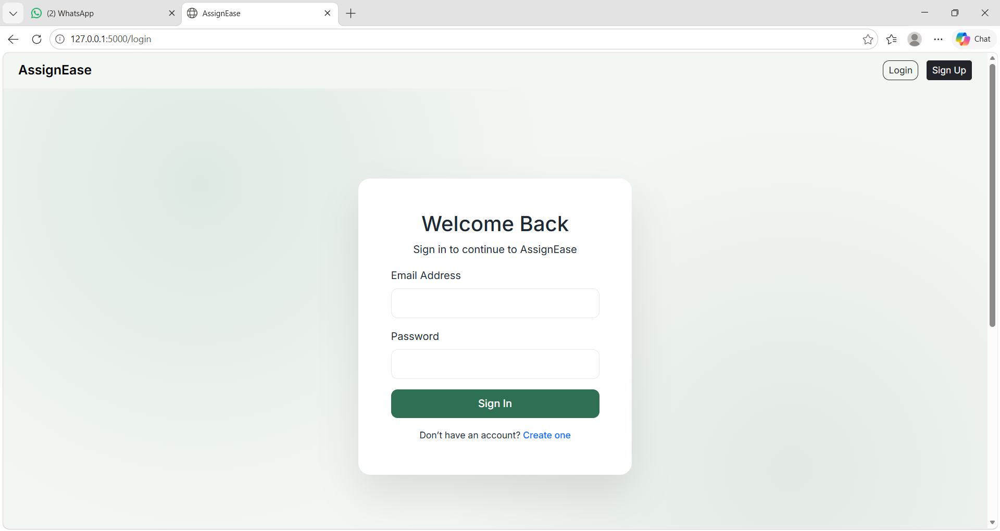
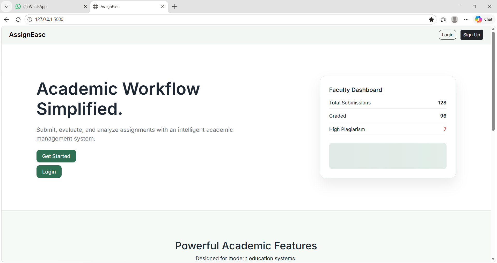
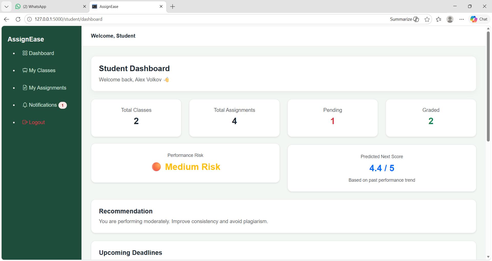
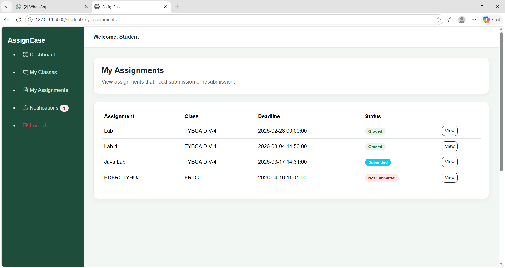
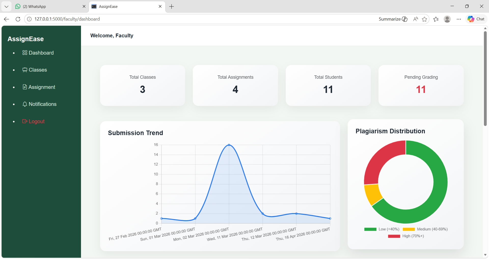
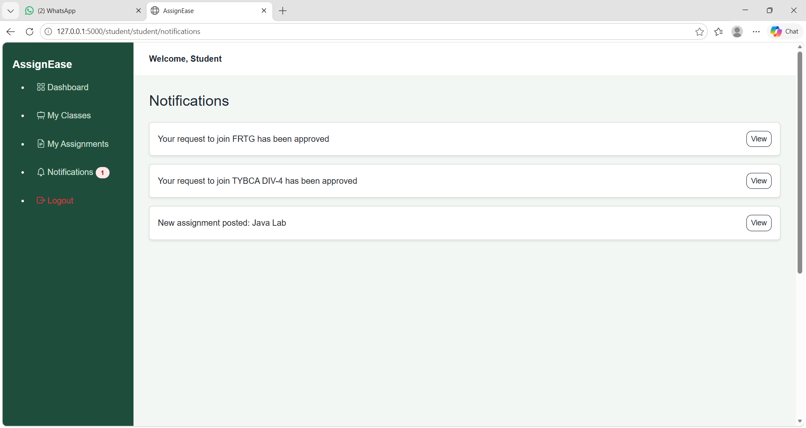

# assignease-project
“A full-stack assignment submission system with plagiarism detection, along with a student performance tracking system, built using Python and MySQL on a localhost server.”

## 🚀 Features
- Create and manage classes
- Assignment submission system
- Plagiarism detection
- Student performance tracking
- Notifications and updates

## 🛠 Tech Stack
- Python (Flask)
- MySQL
- HTML, CSS, JavaScript
- Bootstrap

## 📁 Project Structure
- models/ → database models
- routes/ → application routes
- templates/ → HTML pages
- static/ → CSS, JS files

## ⚙️ Setup Instructions
1. Clone the repository
2. Create virtual environment:
   python -m venv venv
3. Activate:
   venv\Scripts\activate
4. Install dependencies:
   pip install -r requirements.txt
5. Run:
   python app.py

## 📸 Screenshots

### 🔐 Login Page

### 🏠 Home / Dashboard

### 🎓 Student Dashboard

### 📚 Student Assignments

### 🧑‍🏫 Faculty Dashboard

### 🔔 Notifications

## 📌 Note
Uploads folder is excluded as it contains user-generated data.
